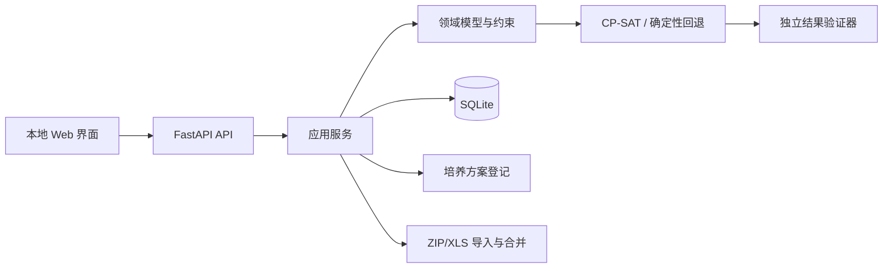

# 架构说明

## 形态

项目采用本地优先的模块化单体：FastAPI 提供 API 并托管静态前端，SQLite 持久化本地账号、学生档案、课程目录和规划运行，纯 Python 领域层与 Web/数据库解耦。

## 关键边界

- `domain` 不导入 FastAPI、SQLAlchemy 或 XLS 解析器。
- `importers` 输出带原始证据的中间模型，不直接宣称数据是真实可选状态。
- `application` 负责把持久化目录映射到领域对象，并应用显式数据确认。
- `scheduling` 只接收完整 `SchedulingProblem`，先覆盖课程、后优化偏好。
- `validation` 独立重新检查求解结果，防止模型或集成缺陷漏出。

## 时间模型

每个教学班可以包含多个 `Meeting`。精确时间由 64 位周次位图、星期、开始节次和结束节次组成；单双周和周末补课按真实周集合求交。时间精度分为：

- `EXACT_SLOT`：可用于冲突证明；
- `WEEK_ONLY`：只有周次；
- `DATE_RANGE`：日期范围但无节次；
- `TBD`：待定；
- `ASYNC`：异步活动。

除异步记录外，非精确时间默认需要用户确认，并持续显示风险。

## 求解目标

1. 最大化已排课程优先级总分；
2. 在覆盖分相同的前提下，最小化未知时段、旧快照或低置信记录等数据风险，以及行政班不匹配、教师、时间与上课日等软偏好代价；
3. 用精确赋值 no-good 约束按推荐顺序生成不同备选方案；
4. 最多返回 10 种，并额外探测第 11 种，以区分“已经列完”和“仅返回前 10 种”；
5. 对每个返回方案及截断探针独立验证。

必须课程、锁定教学班、时间冲突、硬教师规则和硬禁排时间均不可违反。若不存在可行方案，返回结构化诊断，不自动放宽硬约束。

若额外探测因求解时限结束而无法证明有或没有更多方案，响应不会声称已经列完；前端会用不确定状态提示用户。

行政班推荐是高优先级软目标而非硬禁令：如果用户的教师或时间硬约束迫使软件跨班，结果会显示教学班组成、偏好与风险代价及资格核对警告。

## 状态与可恢复性

- `SavedPreferences` 按本地用户保存版本化排课草稿；草稿允许尚未完成的课程和约束。
- `PlanningRun` 保存每次生成的原始请求、结果、时间与课程库指纹，历史方案严格按用户隔离。
- 读取草稿或历史时会重新计算课程库指纹；数据更新后旧方案仍可查看，但必须显示过期并建议重新求解。
- 培养方案身份键同时核验学院、专业名称、可选专业代码、年级适用范围、班型和合作项目；名称与代码矛盾时拒绝自动套用。

## 安全

- 默认只绑定 `127.0.0.1`。
- 本地密码使用 Argon2id 哈希，登录使用随机不透明令牌；数据库只保存令牌 SHA-256。
- 软件不包含学校 SSO 集成，也不保存教务凭据。
- ZIP 导入在内存中完成并执行成员路径、压缩比、加密和类型校验。
- 所有导入与课程目录刷新在事务中完成。
